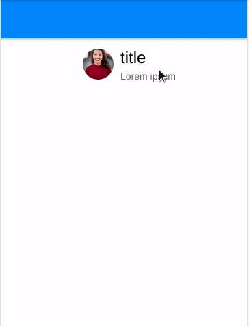

![Built With Stencil](https://img.shields.io/badge/-Built%20With%20Stencil-16161d.svg?logo=data%3Aimage%2Fsvg%2Bxml%3Bbase64%2CPD94bWwgdmVyc2lvbj0iMS4wIiBlbmNvZGluZz0idXRmLTgiPz4KPCEtLSBHZW5lcmF0b3I6IEFkb2JlIElsbHVzdHJhdG9yIDE5LjIuMSwgU1ZHIEV4cG9ydCBQbHVnLUluIC4gU1ZHIFZlcnNpb246IDYuMDAgQnVpbGQgMCkgIC0tPgo8c3ZnIHZlcnNpb249IjEuMSIgaWQ9IkxheWVyXzEiIHhtbG5zPSJodHRwOi8vd3d3LnczLm9yZy8yMDAwL3N2ZyIgeG1sbnM6eGxpbms9Imh0dHA6Ly93d3cudzMub3JnLzE5OTkveGxpbmsiIHg9IjBweCIgeT0iMHB4IgoJIHZpZXdCb3g9IjAgMCA1MTIgNTEyIiBzdHlsZT0iZW5hYmxlLWJhY2tncm91bmQ6bmV3IDAgMCA1MTIgNTEyOyIgeG1sOnNwYWNlPSJwcmVzZXJ2ZSI%2BCjxzdHlsZSB0eXBlPSJ0ZXh0L2NzcyI%2BCgkuc3Qwe2ZpbGw6I0ZGRkZGRjt9Cjwvc3R5bGU%2BCjxwYXRoIGNsYXNzPSJzdDAiIGQ9Ik00MjQuNywzNzMuOWMwLDM3LjYtNTUuMSw2OC42LTkyLjcsNjguNkgxODAuNGMtMzcuOSwwLTkyLjctMzAuNy05Mi43LTY4LjZ2LTMuNmgzMzYuOVYzNzMuOXoiLz4KPHBhdGggY2xhc3M9InN0MCIgZD0iTTQyNC43LDI5Mi4xSDE4MC40Yy0zNy42LDAtOTIuNy0zMS05Mi43LTY4LjZ2LTMuNkgzMzJjMzcuNiwwLDkyLjcsMzEsOTIuNyw2OC42VjI5Mi4xeiIvPgo8cGF0aCBjbGFzcz0ic3QwIiBkPSJNNDI0LjcsMTQxLjdIODcuN3YtMy42YzAtMzcuNiw1NC44LTY4LjYsOTIuNy02OC42SDMzMmMzNy45LDAsOTIuNywzMC43LDkyLjcsNjguNlYxNDEuN3oiLz4KPC9zdmc%2BCg%3D%3D&colorA=16161d&style=flat-square) [](https://github.com/ellerbrock/open-source-badges/)

# Facebook Messenger Slide Component [](https://travis-ci.com/abakermi/fb-msg-slide) [](https://badge.fury.io/js/gitachange)

A slide component with extra actions built with StencilJS




## Getting Started

to use this component inside your project run the follwing command 

```bash
npm install --save fb-msg-slide
```
To view the build, start an HTTP server inside of the /www directory.
```bash
npm install
npm start
```

To build the component for production, run:

```bash
npm run build
```

To run the unit tests for the components, run:

```bash
npm test
```

Need help? Check out our docs [here](https://stenciljs.com/docs/my-first-component).


## Using this component

### Script tag


Put this script  `<script src='https://unpkg.com/my-component@0.0.1/dist/mycomponent.js'></script>` in the head of your index.html
 
  ```html
     <fb-msg-slide>
        <div slot="item-start" >
         <span class="fa fa-eye"></span>

        </div>
        <div slot="item-middle" class="_middle" >
          
         <p><strong>M.John</strong><br>Lorem ipsum dolor sit.</p>
        </div>
        <div slot="item-end" >
          <span class="fa fa-trash"></span>
        </div>
      
      
        </fb-msg-slide>

  ``` 

### Node  (ionic)

register component in ```main.ts ```
```js

//main.ts
import { defineCustomElements } from 'fb-msg-slide/loader';

//...

defineCustomElements()
```
add  ```CUSTOM_ELEMENTS_SCHEMA``` to your module

```js
//yourmodule.ts
//...

 schemas: [CUSTOM_ELEMENTS_SCHEMA]
```
use it !

```html
<fb-msg-slide>
       <div slot="item-start">
           <!-- element -->
       </div>
       <fb-msg-slide>
       <div slot="item-middle">
           <!-- element -->
       </div>
       <fb-msg-slide>
       <div slot="item-end">
           <!-- element -->
       </div>
  </fb-msg-slide>

```
## License

MIT © [Abdelhak Akermi](https://github.com/abakermi)